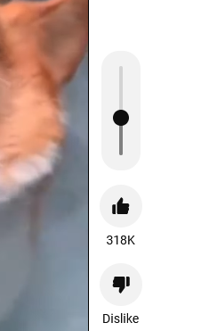

# youtube-shorts-volume
Tampermonkey script which adds a volume slider to the Youtube shorts interface

### Usage
* Install Tampermonkey from [here](https://www.tampermonkey.net/).
* Use the "Create new script..." under the plugin icon in your browser
* Copy-paste the script. It will be automatically named and URL triggers added

By default the volume slider is exponential meaning roughly the first half of the slider changes the volume very little and the latter half much more quickly. This is to compensate for the often very loud volume of shorts videos. The distribution is the only thing changed from a standard volume slider so all volumes can still be set.

If you prefer the standard behaviour change `const VOLUME_FUNCTION = 'exponential'` to `const VOLUME_FUNCTION = 'linear'`

### Preview

### Notes
The styling shown in the preview is Firefox only for the moment. Chrome will get a mostly default look due to CSS inconsistensies. All functionality is identical.